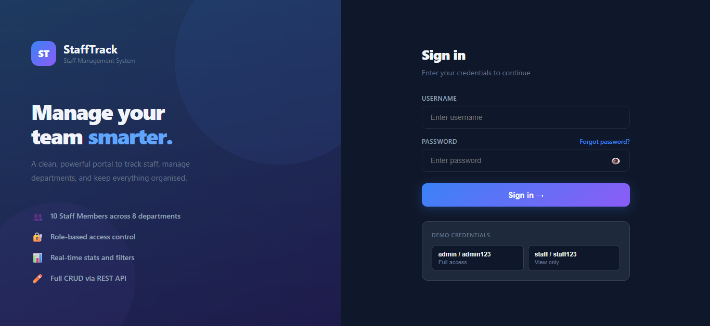

# Staff Track

A full-stack Staff Management System developed using React.js and Python Flask.

## Features
- Secure Staff Login
- Dashboard
- Add Staff
- View Staff Details
- Update Staff Information
- Delete Staff Records
- Search Staff
- Responsive User Interface

## Technologies Used

### Frontend
- React.js
- Vite
- HTML5
- CSS3
- JavaScript

### Backend
- Python
- Flask

## Project Structure
...

## Installation
...

## Screenshots

### Home Page

### Employee List

### Add Employee

## Author

**Kirthika S**

B.Sc Computer Science Student

## GitHub

https://github.com/KIRTHIKA0816/staff-track
